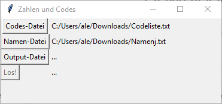

# py-zahlen-und-codes

Kleine Python / Tk Applikation um Werte aus zwei Dateien zusammenzufügen



## Notes

- Ein Tutorial für Tk: [Python GUI examples (Tkinter Tutorial)](https://likegeeks.com/python-gui-examples-tkinter-tutorial/)

## Assets

The icon is from

<http://www.iconarchive.com/show/blue-bits-icons-by-icojam/database-icon.html>

but the downloaded files did not work with pyinstaller.

I've uploaded the png to <https://icoconvert.com/> and the resulting file did work.

## Crate the EXE


```
pip install pyinstaller
pyinstaller --onefile --windowed --icon assets\database_icon.ico --name zahlen-und-codes main.py
```

The exe will be in the `dist` directory
